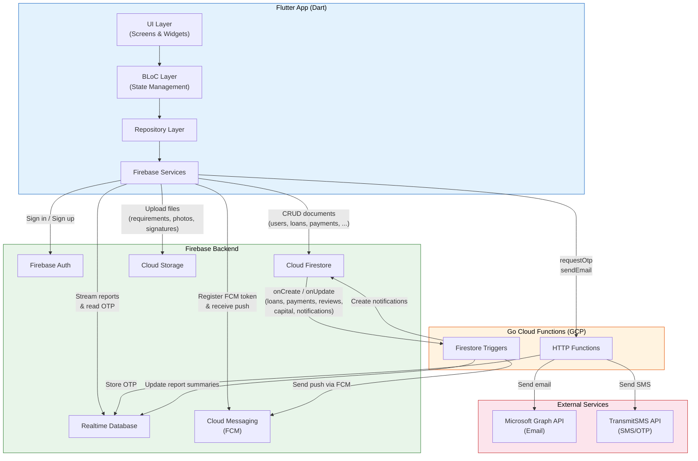
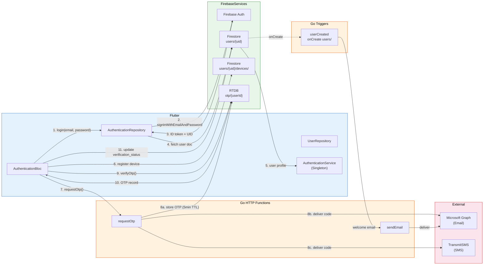
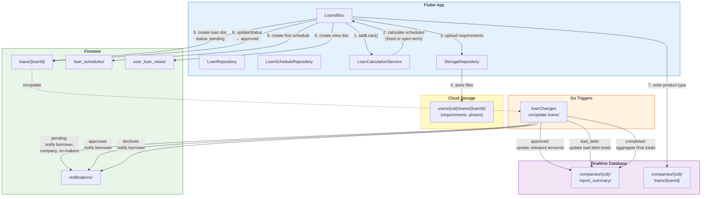
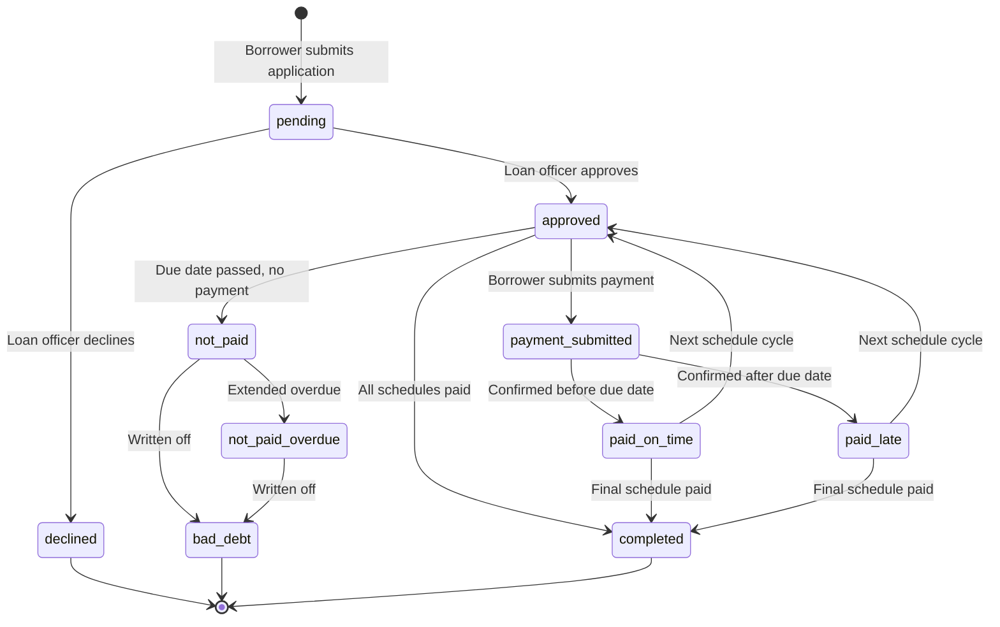
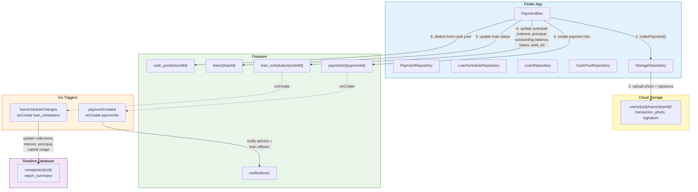
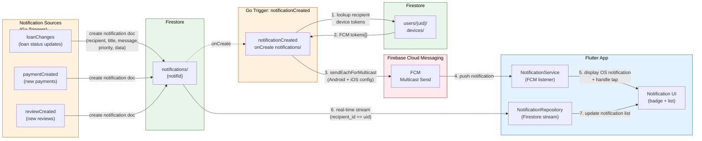
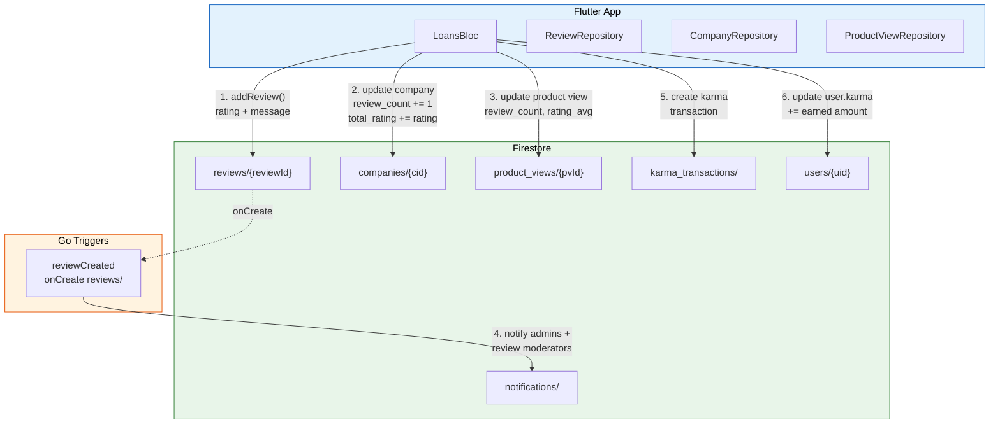
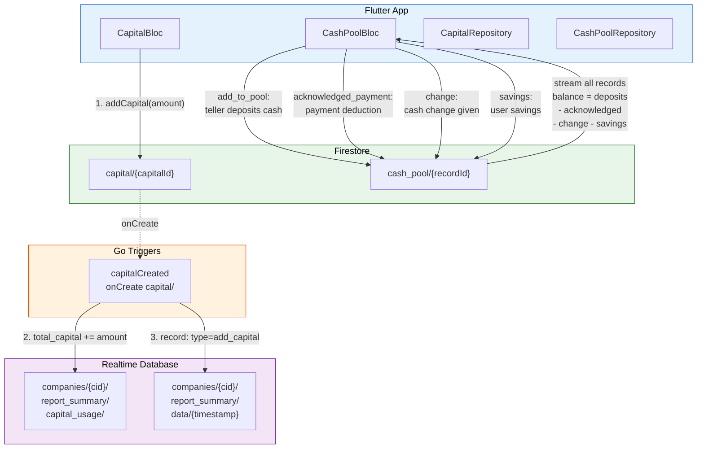
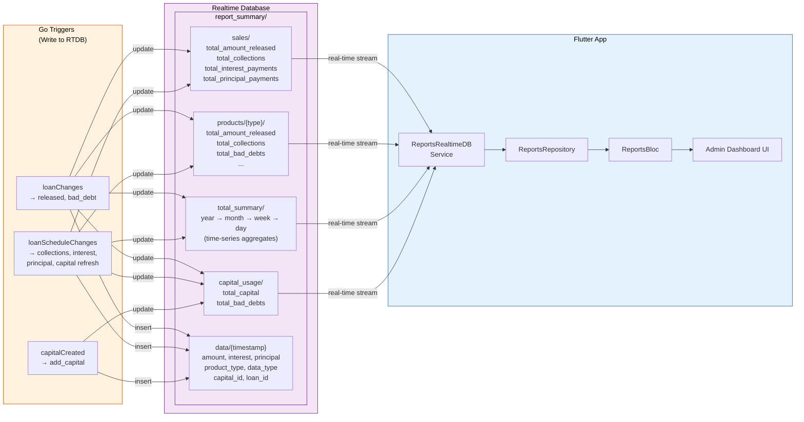
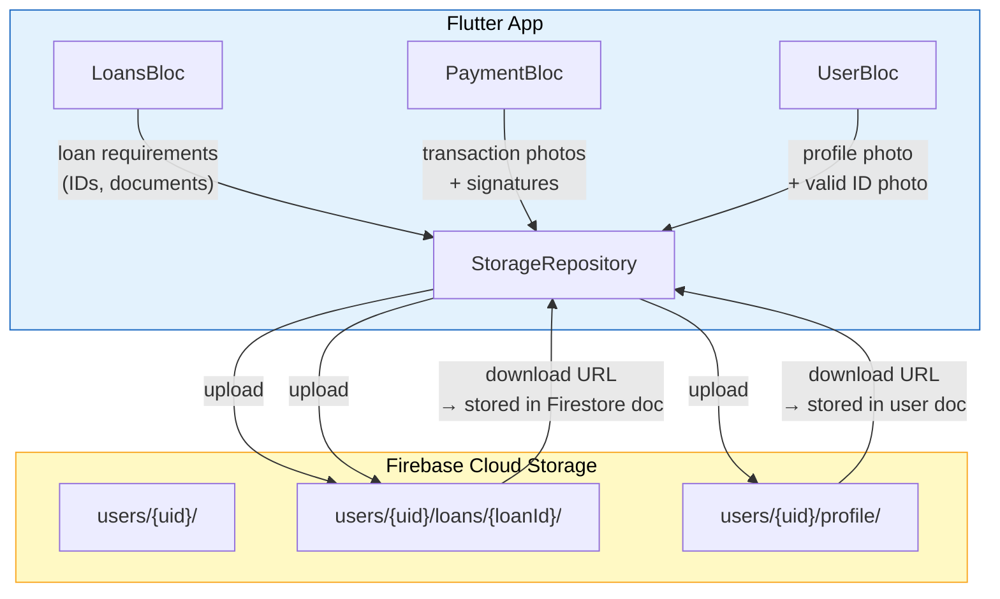

# Data Flow Diagrams

## 1. System Overview

---

## 2. Authentication & User Management

---

## 3. Loan Lifecycle

### Loan Status State Machine

---

## 4. Payment Flow

---

## 5. Notification Flow (End-to-End)

---

## 6. Review & Karma Flow

---

## 7. Capital & Cash Pool Flow

---

## 8. Reports Flow (Real-time Analytics)

---

## 9. File Storage Flow

---

## 10. Complete Trigger Map

| Go Function | Type | Firestore Event | Reads | Writes |
|-------------|------|-----------------|-------|--------|
| `requestOtp` | HTTP | - | JWT token | RTDB `otp/`, Email/SMS |
| `sendEmail` | HTTP | - | Request body | Microsoft Graph API |
| `userCreated` | Trigger | `onCreate users/{uid}` | New user doc | `sendEmail` (welcome) |
| `loanChanges` | Trigger | `onUpdate loans/{id}` | Loan doc, schedules, company users | RTDB reports, Firestore notifications |
| `paymentCreated` | Trigger | `onCreate payments/{id}` | Payment, loan, company users | Firestore notifications |
| `loanScheduleChanges` | Trigger | `onCreate loan_schedules/{id}` | Schedule doc, loan doc | RTDB reports |
| `reviewCreated` | Trigger | `onCreate reviews/{id}` | Review, company users | Firestore notifications |
| `capitalCreated` | Trigger | `onCreate capital/{id}` | Capital doc | RTDB reports |
| `notificationCreated` | Trigger | `onCreate notifications/{id}` | Notification, user devices | FCM multicast push |

---

## Color Legend

| Color | Represents |
|-------|------------|
| Blue | Flutter App (client-side) |
| Orange | Go Cloud Functions (server-side) |
| Green | Cloud Firestore (document DB) |
| Purple | Realtime Database (analytics/OTP) |
| Yellow | Cloud Storage (files) |
| Red/Pink | External services (Email, SMS, FCM) |
