# Entity Relationship Diagram

```mermaid
erDiagram
    %% ============================================================
    %% CORE ENTITIES
    %% ============================================================

    User {
        String id PK
        DateTime createdAt
        DateTime updatedAt
        DateTime deletedAt
        String firstName
        String lastName
        String middleName
        DateTime birthDate
        String mobileNumber
        String emailAddress
        UserRole userRole
        ImageUrl profilePhotoUrl
        ImageUrl photoWithValidIdUrl
        String facebookProfileUrl
        double karma
        String aiVerifyRef
        int verificationStatus
        String companyId FK
        Sex sex
        String businessName
    }

    EmploymentDetails {
        String id PK
        DateTime createdAt
        DateTime updatedAt
        DateTime deletedAt
        String userId FK
        EmploymentStatus employmentStatus
        String employerName
        List_int salaryDays
    }

    Company {
        String id PK
        DateTime createdAt
        DateTime updatedAt
        DateTime deletedAt
        String name
        String tagLine
        String secNumber
        String tin
        ImageUrl companyProfilePhotoUrl
        String emailAddress
        double totalRating
        int reviewCount
        CompanyType type
        CompanyManagementType managementType
    }

    Product {
        String id PK
        DateTime createdAt
        DateTime updatedAt
        DateTime deletedAt
        String providerId FK
        String loanType
        String term
        bool forceCollect
        double interestRate
        double maxLoanableAmount
        int maxPeriod
        bool allowRequestMaxLoanAmountExtension
        FileUrl termsConditionUrl
        int requiredCoMakerCount
        bool allowAddOns
    }

    Charge {
        String id PK
        double amount
        String description
        bool isPercentage
        bool isUpfrontCollection
    }

    Requirement {
        String id PK
        String name
        int quantity
    }

    Loan {
        String id PK
        DateTime createdAt
        DateTime updatedAt
        DateTime deletedAt
        String userId FK
        String companyId FK
        String productId FK
        double amount
        double additionalCharges
        double deductions
        int period
        bool isForceCollect
        LoanStatus status
        DateTime dueAt
        String reason
        double interestRate
        String term
        double amortization
        double additionalChargeUpfrontCollection
        List_String coMakerUserIds FK
        String parentId FK
    }

    RequirementSubmission {
        String requirementId FK
        String name
        FileUrl url
    }

    AdditionalLoanAmount {
        String id PK
        DateTime createdAt
        DateTime updatedAt
        DateTime deletedAt
        String loanId FK
        double amount
        String description
        double additionalCharges
        double advanceCharges
        double deductions
        ImageUrl signatureUrl
        ImageUrl selfiePhotoUrl
        LoanStatus status
    }

    LoanSchedule {
        String id PK
        DateTime createdAt
        DateTime updatedAt
        DateTime deletedAt
        String loanId FK
        String companyId FK
        double outstandingBalance
        double principalPayment
        double interestPayment
        double advanceInterestPayments
        double amortization
        double extraPayment
        String paymentId FK
        DateTime paidAt
        DateTime dueAt
        LoanStatus status
        bool isOpenTerm
        double interestCharge
        double interestDayMultiplier
    }

    Payment {
        String id PK
        DateTime createdAt
        DateTime updatedAt
        DateTime deletedAt
        String userId FK
        String loanScheduleId FK
        ImageUrl transactionPhotoUrl
        ImageUrl signatureUrl
        String autoCollectRef
        String confirmedBy FK
        String comment
        DateTime confirmedAt
    }

    Review {
        String id PK
        DateTime createdAt
        DateTime updatedAt
        DateTime deletedAt
        String providerId FK
        String productId FK
        String userId FK
        String userFullName
        String message
        int rating
    }

    Capital {
        String id PK
        DateTime createdAt
        DateTime updatedAt
        DateTime deletedAt
        String providerId FK
        double amount
    }

    Transaction {
        String id PK
        DateTime createdAt
        DateTime updatedAt
        DateTime deletedAt
        String providerId FK
        String userId FK
        String loanId FK
        String paymentId FK
        String karmaId FK
    }

    KarmaTransaction {
        String id PK
        DateTime createdAt
        DateTime updatedAt
        DateTime deletedAt
        String userId FK
        double karma
        String description
    }

    CashPool {
        String id PK
        DateTime createdAt
        DateTime updatedAt
        DateTime deletedAt
        String userId FK
        double amount
        CashPoolStatus status
        String loanId FK
        String paymentId FK
        String comment
    }

    Notification {
        String id PK
        DateTime createdAt
        DateTime updatedAt
        DateTime deletedAt
        String recipientId FK
        String title
        String message
        bool read
        NotificationPriority priority
    }

    NotificationData {
        String id PK
        DateTime createdAt
        DateTime updatedAt
        DateTime deletedAt
        NotificationDataType type
        String productId FK
        String loanId FK
        String paymentId FK
        String capitalId FK
        String companyId FK
        String reviewId FK
        String userId FK
        String karmaId FK
    }

    Address {
        String id PK
        DateTime createdAt
        DateTime updatedAt
        DateTime deletedAt
        String dataId FK
        DataType dataType
        String line1
        String line2
        String barangay
        String city
        String province
        String country
        String zipCode
        double latitude
        double longitude
    }

    BankDetails {
        String id PK
        DateTime createdAt
        DateTime updatedAt
        DateTime deletedAt
        String dataId FK
        DataType dataType
        String bankName
        String accountNumber
        String accountName
    }

    Settings {
        String id PK
        DateTime createdAt
        DateTime updatedAt
        DateTime deletedAt
        String userId FK
        bool useClassicUI
        bool forcePaymentConfirmation
        bool enableProductAddOns
    }

    Device {
        String id PK
        DateTime createdAt
        DateTime updatedAt
        DateTime deletedAt
        String model
        String os
        String version
        String token
    }

    UserOtp {
        String id PK
        DateTime createdAt
        DateTime updatedAt
        DateTime deletedAt
        DateTime expireAt
        String otp
        String userId FK
    }

    %% ============================================================
    %% DENORMALIZED VIEW ENTITIES
    %% ============================================================

    ProductView {
        String id PK
        DateTime createdAt
        DateTime updatedAt
        DateTime deletedAt
        String companyId FK
        String companyName
        String tagLine
        ImageUrl companyProfilePhotoUrl
        String productId FK
        String loanType
        String term
        double interestRate
        double maxLoanableAmount
        int maxPeriod
        double reviewRatingAvg
        int reviewCount
        bool allowAddOns
    }

    TransactionView {
        String id PK
        DateTime createdAt
        DateTime updatedAt
        DateTime deletedAt
        String transactionId FK
        String userFullName
        String providerCompanyName
        String loanType
        LoanStatus loanStatus
        double paymentAmount
        double karma
    }

    UserLoanView {
        String id PK
        DateTime createdAt
        DateTime updatedAt
        DateTime deletedAt
        String userId FK
        String loanId FK
        String productId FK
        String loanType
        String userFullName
        DateTime loanCreatedAt
        DateTime loanDueAt
        LoanStatus loanStatus
        String companyName
        String companyId FK
        double amount
        double amortization
    }

    %% ============================================================
    %% RELATIONSHIPS
    %% ============================================================

    %% User relationships
    User ||--o| Company : "belongs to (companyId)"
    User ||--|{ EmploymentDetails : "has"
    User ||--o{ Device : "has"
    User ||--o{ UserOtp : "has"
    User ||--o| Settings : "has"
    User ||--o{ Address : "has (dataType=user)"
    User ||--o{ BankDetails : "has (dataType=user)"

    %% Company relationships
    Company ||--o{ Product : "offers (providerId)"
    Company ||--o{ Capital : "has (providerId)"
    Company ||--o{ Address : "has (dataType=provider)"
    Company ||--o{ BankDetails : "has (dataType=provider)"

    %% Product relationships
    Product ||--o{ Charge : "has additionalCharges/deductions"
    Product ||--o{ Requirement : "has"

    %% Loan relationships
    Loan }o--|| User : "borrowed by (userId)"
    Loan }o--|| Company : "issued by (companyId)"
    Loan }o--|| Product : "based on (productId)"
    Loan ||--o{ RequirementSubmission : "has"
    Loan ||--o{ AdditionalLoanAmount : "has add-ons (loanId)"
    Loan ||--o{ LoanSchedule : "has (loanId)"
    Loan ||--o| Loan : "renewed from (parentId)"

    %% LoanSchedule relationships
    LoanSchedule }o--|| Company : "belongs to (companyId)"
    LoanSchedule ||--o| Payment : "paid by (paymentId)"

    %% Payment relationships
    Payment }o--|| User : "made by (userId)"
    Payment }o--|| LoanSchedule : "for (loanScheduleId)"

    %% Review relationships
    Review }o--|| Company : "reviews (providerId)"
    Review }o--o| Product : "reviews (productId)"
    Review }o--|| User : "written by (userId)"

    %% Transaction relationships
    Transaction }o--|| Company : "involves (providerId)"
    Transaction }o--|| User : "involves (userId)"
    Transaction }o--|| Loan : "for (loanId)"
    Transaction }o--|| Payment : "for (paymentId)"
    Transaction }o--|| KarmaTransaction : "includes (karmaId)"

    %% KarmaTransaction relationships
    KarmaTransaction }o--|| User : "for (userId)"

    %% CashPool relationships
    CashPool }o--|| User : "belongs to (userId)"
    CashPool }o--o| Loan : "for (loanId)"
    CashPool }o--o| Payment : "for (paymentId)"

    %% Notification relationships
    Notification }o--|| User : "sent to (recipientId)"
    Notification ||--o| NotificationData : "has data"

    %% NotificationData polymorphic references
    NotificationData }o--o| Product : "references (productId)"
    NotificationData }o--o| Loan : "references (loanId)"
    NotificationData }o--o| Payment : "references (paymentId)"
    NotificationData }o--o| Capital : "references (capitalId)"
    NotificationData }o--o| Company : "references (companyId)"
    NotificationData }o--o| Review : "references (reviewId)"
    NotificationData }o--o| User : "references (userId)"
    NotificationData }o--o| KarmaTransaction : "references (karmaId)"

    %% View entity relationships (denormalized)
    ProductView }o--|| Company : "from (companyId)"
    ProductView }o--|| Product : "from (productId)"
    TransactionView }o--|| Transaction : "from (transactionId)"
    UserLoanView }o--|| User : "for (userId)"
    UserLoanView }o--|| Loan : "for (loanId)"
    UserLoanView }o--|| Product : "for (productId)"
    UserLoanView }o--|| Company : "for (companyId)"
```

## Legend

| Symbol | Meaning |
|--------|---------|
| `\|\|--\|{` | One-to-many (required) |
| `\|\|--o{` | One-to-many (optional) |
| `}o--\|\|` | Many-to-one (required) |
| `}o--o\|` | Many-to-one (optional) |
| `\|\|--o\|` | One-to-one (optional) |

## Enums

| Enum | Values |
|------|--------|
| **UserRole** | appAdmin, customer, admin, loanOfficer, teller, reviewModerator |
| **Sex** | male, female |
| **EmploymentStatus** | selfEmployed, employed |
| **CompanyType** | secRegistered, personal |
| **CompanyManagementType** | app, selfManaged |
| **LoanStatus** | pending, declined, approved, payment_submitted, paid_on_time, paid_late, not_paid, not_paid_overdue, completed, bad_debt |
| **CashPoolStatus** | add_to_pool, acknowledged_payment, change, savings |
| **NotificationPriority** | high, normal |
| **NotificationDataType** | system, product, loan, payment, capital, company, review, user, karma |
| **DataType** | user, provider |
